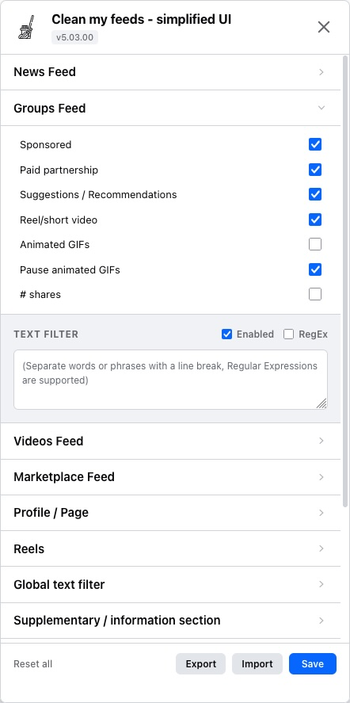

# FB - Clean My Feeds (Simplified UI)

[](https://github.com/trinhquocviet/facebook-clean-my-feeds)
[](package.json)
[](LICENSE)

A userscript for Tampermonkey and Violentmonkey that hides sponsored posts, suggested content, Reels, and unwanted items across Facebook feeds.

---

## About This Fork

This repository is a fork of [zbluebugz/facebook-clean-my-feeds](https://github.com/zbluebugz/facebook-clean-my-feeds) (Greasy Fork [#431970](https://greasyfork.org/en/scripts/431970-fb-clean-my-feeds)).

The original version was inactive for a long time, which is the reason for this fork.

Key points of this version:
- Maintains the rules to detect Facebook posts.
- Removes and simplifies configuration options to focus on the main functions.
- Refactored into a modular codebase with local browser storage.

---

<p align="center">
  
</p>

## Features

- **News Feed**: Hides sponsored posts, suggested posts, "People you may know", and Reels.
- **Groups Feed**: Hides sponsored posts, suggestions, and posts from groups you have not joined.
- **Videos Feed**: Hides sponsored videos, duplicate video cards, and live broadcasts; option to disable Reels auto-looping.
- **Marketplace**: Hides sponsored listings, with price and description text filters.
- **Profile / Pages**: Option to hide posts from profiles and pages you do not follow.
- **Text & RegEx Filters**: Block posts matching custom keywords or regular expressions per feed or globally.
- **Auto-redirect**: Option to automatically redirect to Facebook's chronological "Most Recent" feed.

---

## Installation

### Prerequisites
Install a userscript manager extension in your browser: Violentmonkey, Tampermonkey

### Install Script
Click to install the userscript from the latest release: **[Install FB - Clean My Feeds](https://github.com/trinhquocviet/facebook-clean-my-feeds/releases/latest/download/fb-clean-my-feeds.user.js)**

---

## Video Ads Note

This userscript does not block in-stream video ads (pre-roll, mid-roll, end-roll). To block video ads, you can use [uBlock Origin](https://github.com/gorhill/uBlock) with this filter rule:
```adblock
facebook.com##+js(set, Object.prototype.scrubber, undefined)
```

---

## User-interface languages supported

- English
- Português (Portugal & Brazil)
- Deutsch (Germany)
- Français (France)
- Espanol (Spain)
- Čeština (Czech)
- Tiếng Việt (Vietnam)
- Italino (Italy)
- Latviešu (Latvia)
- Polski (Poland)
- Nederlands (Netherlands)
- עִברִית (Hebrew)
- العربية (Arabic)
- Bahasa Indonesia (Indonesia)
- 简体中文 (Chinese Simplified)
- 繁體中文 (Chinese Traditional)
- 日本 (Japan)
- Sumoi (Finland)
- Türkçe (Turkey)
- Ελληνικά (Greece)
- Русский (Russia)
- Україна (Ukraine)
- България (Bulgaria)

---

## Documentation

Additional technical documentation is available in the [`docs/`](docs/) directory:

- **[Architecture Guide](docs/ARCHITECTURE.md)**: Module structure, build pipeline, storage, adaptive scheduler, and observer lifecycle.
- **[Detection Rules & Reverse-Engineering Guide](docs/DETECTION_RULES.md)**: Comprehensive breakdown of Facebook DOM detection rules, Shadow DOM traversal, SVG xlink caching, and tracking query heuristics.
- **[Simplified UI & Configuration Guide](docs/SIMPLIFIED_UI_AND_CONFIGS.md)**: Details on the simplified options and modal guide.
- **[Developer & Contributing Guide](docs/DEVELOPMENT.md)**: Local setup, build scripts, test execution, and localization instructions.

---

## Development

```bash
# Install dependencies
bun install

# Run unit tests
bun test

# Build userscript distribution to dist/
bun run build

# Watch mode for development
bun run dev
```

*Note: Automated builds output to `dist/fb-clean-my-feeds.user.js`.*

---

## Credits & License

- **Original Creator**: [zbluebugz](https://github.com/zbluebugz/facebook-clean-my-feeds)
- **Fork Maintainer**: [trinhquocviet](https://github.com/trinhquocviet)
- **License**: [MIT License](LICENSE)
