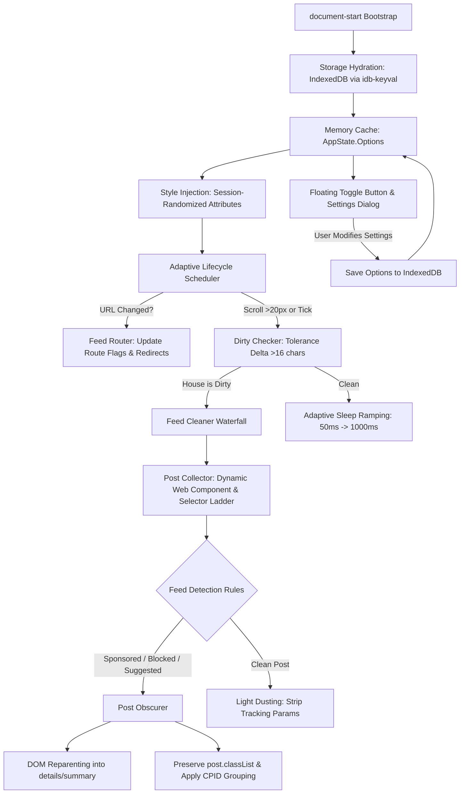

# Architecture & System Design

## 1. Overview

**FB - Clean My Feeds** is a high-performance, modular client-side browser userscript designed to clean Facebook feeds in real time without causing page freezing, layout shifts, or breaking Facebook's internal React rendering tree.

It features an adaptive, event-driven scheduler that monitors DOM changes via an intelligent dirty-checking heuristic, classifies posts using a multi-tiered reverse-engineered selector ladder, non-destructively conceals unwanted items using `<details><summary>` DOM reparenting and CSS class preservation, and manages user preferences locally in IndexedDB with zero external telemetry.



---

## 2. Source Code Organization

```text
src/
├── index.js                     # Userscript master bootstrap sequence
├── constants/
│   ├── assets.js                # Base64 icons, SVGs, and brand assets
│   ├── config.js                # Timing constants, debounce values, scan limits
│   ├── db.js                    # IndexedDB database name and key constants
│   ├── dom.js                   # DOM attributes (cmfr, cmfcpid, cmfDusted, etc.)
│   └── index.js                 # Barrel exports for constants
├── i18n/
│   ├── defaults.js              # Baseline translations and fallback dictionary
│   ├── helpers.js               # Language resolution and dictionary builders
│   ├── paths.js                 # Language path resolvers
│   ├── index.js                 # i18n module entry point
│   └── locales/                 # 23 discrete locale files (en.js, vi.js, etc.)
├── state/
│   ├── app-state.js             # Initial state schema & static object topology
│   └── index.js                 # State module exports
├── styles/
│   ├── dialog-rules.js          # Settings modal CSS, pure CSS dark mode & tabs
│   ├── post-rules.js            # Post hiding, summary toggle, mini-caption rules
│   ├── toggle-rules.js          # Floating mop & bucket button styling
│   └── index.js                 # Styles module exports
├── utils/
│   ├── css-builder.js           # CSS-in-JS compiler (objectToCss, compileRules)
│   ├── dom.js                   # Safe node traversal (climbUpTheTree, countDescendants)
│   ├── number.js                # Numeric & abbreviated metric parser (getFullNumber)
│   ├── text.js                  # Unicode normalizer (cleanText), random string generator
│   ├── url.js                   # URL parser and canonical publisher path extractor
│   └── index.js                 # Utilities exports
└── modules/
    ├── detection/               # Feed post detection and reverse-engineered filters
    │   ├── post-collector.js    # Multi-tiered post collection & custom Web Component selector
    │   ├── scanner.js           # doLightDusting, TreeWalker scanner, alt text extractor
    │   ├── scrubbers.js         # swatTheMosquitos (GIF pauser), sidebar & banner scrubbers
    │   ├── sponsored.js         # Shadow DOM 1 & 2, indirect SVG xlink, parameter heuristics
    │   ├── text-filter.js       # 5-block text analysis & Marketplace price blocking
    │   ├── rules/
    │   │   ├── groups.js        # Groups feed rules (suggested cards, unjoined headers)
    │   │   ├── news-feed.js     # News feed rules (Unicode digits, PYMK, reels, partnerships)
    │   │   └── videos.js        # Video rules (live broadcasts, duplicates, Instagram)
    │   └── index.js             # Detection module exports
    ├── dirty-checker/           # High-efficiency DOM change detection
    │   ├── dirty-checker.js     # 16-char tolerance heuristic & dialog container checks
    │   └── index.js             # Dirty checker exports
    ├── feed-cleaners/           # Specialized cleaners per Facebook surface
    │   ├── factory.js           # IoC container and cleaner state binding
    │   ├── groups-cleaner.js    # Groups feed cleaner (stream vs single group)
    │   ├── marketplace-cleaner.js # Marketplace cards and modal cleaner
    │   ├── news-feed-cleaner.js # News Feed pipeline cleaner
    │   ├── profile-cleaner.js   # User & Page profile wall cleaner
    │   ├── reels-cleaner.js     # Reels player controls injector & loop suppressor
    │   ├── search-cleaner.js    # Search results stream cleaner
    │   ├── watch-cleaner.js     # Videos & Watch feed cleaner
    │   └── index.js             # Feed cleaners exports
    ├── feed-router/             # SPA route tracking and URL redirection
    │   ├── feed-router.js       # Route classification and surface state updates
    │   ├── redirects.js         # Chronological feed (?sk=h_chr) redirection
    │   └── index.js             # Feed router exports
    ├── lifecycle/               # Adaptive execution scheduler
    │   ├── scheduler.js         # 5-tier adaptive sleep loop & event listeners
    │   └── index.js             # Lifecycle module exports
    ├── post-obscurer/           # Post collapsing, reparenting & grouping
    │   ├── caption-builder.js   # Mini-caption formatting and rule attribution
    │   ├── consecutive-group.js # CPID grouping for consecutive hidden posts
    │   ├── post-obscurer.js     # <details><summary> DOM reparenting & class preservation
    │   ├── visibility-toggle.js # Batch debug visibility toggling
    │   └── index.js             # Post obscurer exports
    ├── style-injector/          # CSS stylesheet injection and attribute randomization
    │   ├── style-injector.js    # Session-randomized stealth attributes (hideAtt, showAtt)
    │   └── index.js             # Style injector exports
    ├── dialog/                  # Settings UI modal and floating button
    │   ├── actions.js           # Save, Reset, Import, Export handlers
    │   ├── components.js        # UI component factories (switches, textareas, headers)
    │   ├── createDialog.js      # Modal shell & accordion sections constructor
    │   ├── toggle.js            # Floating toggle button and keyboard shortcuts
    │   ├── updateDialog.js      # Dialog re-render and search filtering
    │   └── index.js             # Dialog module exports
    └── user/                    # User settings schema, compilation, and storage
        ├── defaults.js          # Baseline configuration options schema
        ├── filters.js           # Blocked text and Regular Expression compiler
        ├── storage.js           # Async IndexedDB interface with localStorage fallback
        ├── user-options.js      # Preference serialization and normalization
        └── index.js             # User module exports
```

---

## 3. Runtime Lifecycle & Data Flow

### 3.1 Bootstrap Phase (`src/index.js`)
1. **Script Registration**: Triggers at `@run-at document-start` to register styles and storage listeners before Facebook completes page hydration.
2. **State Container**: `createInitialState()` sets up `VARS` with static property topology to guarantee V8 hidden class stabilization.
3. **Storage Hydration**: Asynchronously reads options from IndexedDB (`idb-keyval`). If options do not exist, seeds default values from `src/modules/user/defaults.js`.
4. **Style Injection**: Generates random attribute names (`hideAtt`, `showAtt`, `hideWithNoCaptionAtt`) per session to evade static selector-based ad-block detection, compiles CSS rules via `compileRules()`, and injects the stylesheet into `<head>`.
5. **UI Mount**: Mounts the floating mop/bucket toggle button (`#fbcmfToggle`) and settings dialog (`#fbcmf`) once `document.body` is available.
6. **Scheduler Ignition**: Launches the adaptive scheduler loop.

### 3.2 Adaptive Lifecycle Scheduler (`src/modules/lifecycle/scheduler.js`)
Instead of using an unconstrained `MutationObserver` that fires hundreds of times per second during infinite scroll, the script employs an adaptive polling and event-driven wake-up architecture:
- **Adaptive Sleep Ramping**:
  - When the DOM changes (house is dirty), loop sleep time resets to **50ms**.
  - As consecutive loops detect no change, the sleep time escalates through 5 tiers: `50ms -> 75ms -> 100ms -> 150ms -> 1000ms`.
- **Event Wake-Ups**:
  - **Scroll Listener**: Wakes the scheduler immediately if user scrolls vertically by more than **20px**.
  - **SPA Navigation**: Detects `popstate` and polls URL pathname every **500ms** to re-route cleaners when the user navigates between News Feed, Groups, Marketplace, and Watch.

### 3.3 Dirty Checking Heuristic (`src/modules/dirty-checker/dirty-checker.js`)
Before running expensive query selectors or TreeWalkers across the DOM:
1. Locates the primary feed container (`[role="feed"]`, `[role="main"]`, or main column).
2. Compares the current `innerHTML.length` against the previously recorded length.
3. If the delta is less than or equal to **16 characters**, the feed is treated as clean, skipping post collection entirely.
4. Checks for newly opened Marketplace or Watch dialog modals.

### 3.4 Post Collection & Classification Ladder
1. **Dynamic Web Component Detection**: Facebook dynamically deploys custom autonomous Web Component tags (e.g. `<ybrgmpsb-unlrhoua>`) to disguise feed items. The collector uses regex `[a-zA-Z0-9]+-[a-zA-Z0-9]+` combined with role checks to discover custom container elements.
2. **Fallback Ladder**: If no custom tag is present, falls back through a 10-level `*:is(span, div)` query ladder, locating candidate feed posts.
3. **Classification Waterfall**:
   - **Sponsored Check**: First checks Shadow DOM canvas elements, colon-prefixed `:r*:` aria tokens, indirect SVG `xlink:href` caches, and `__cft__[0]=` tracking parameter length heuristics (>35 chars).
   - **Text & Keyword Filters**: Scans post content across 5 structural blocks (Block 0: headers, Block 1: title/heading, Block 2: body, Block 3: actions/comments).
   - **Feed Rules**: Evaluates surface-specific heuristics (e.g., like count thresholds, unjoined groups, reels, live streams).
   - **Decontamination**: If the post is clean, executes `doLightDusting()` to strip tracking parameters (`__cft__`, `__tn__`, `notif_t`) from outbound URLs.

### 3.5 Post Obscuring & Layout Preservation (`src/modules/post-obscurer/`)
To hide matched posts without breaking Facebook's virtualized React DOM:
1. **`<details><summary>` DOM Reparenting**: Wraps the original post inside a `<details>` element with an interactive `<summary>` element acting as an unobtrusive collapsed banner.
2. **Class List Duplication**: Copies all CSS classes from `post.classList` onto the `<details>` wrapper so that grid layouts, flexbox sizing, and column widths remain 100% stable.
3. **Consecutive Post Aggregation (CPID)**: Groups back-to-back hidden posts under a single aggregated banner (e.g. *"5 hidden posts"*), reducing visual clutter.
4. **Non-Destructive Reveal**: Clicking the summary reveals the original post without triggering re-fetching or DOM mutations.

---

## 4. State Management & Storage Layer

```text
User Action / Defaults -> idb-keyval (IndexedDB: 'fb_clean_my_feeds')
                                   │
                                   ▼
                         AppState.Options (In-Memory Cache)
                                   │
                                   ▼
                       High-Frequency Cleaner Lookups
```

- **IndexedDB**: Managed via lightweight `idb-keyval` under the database name `fb_clean_my_feeds` and store `cmf_settings`.
- **In-Memory Cache**: `AppState.Options` maintains a synchronous snapshot in memory, eliminating asynchronous latency during millisecond-critical post evaluation.
- **Normalization**: On startup, options are normalized against baseline schemas in `src/modules/user/defaults.js`, ensuring newly added settings receive proper defaults.

---

## 5. Performance & Memory Safety Invariants

1. **Non-Destructive DOM**: Absolute prohibition of `node.remove()` or `parentNode.removeChild()`. Removing posts causes React's reconciler to throw unhandled exceptions and crashes feed pagination.
2. **Layout Thrashing Prevention**: Grouped DOM reads precede DOM writes; innerHTML length caching prevents redundant re-scans.
3. **Session Caching**: Indirect SVG `xlink:href` IDs pointing to "Sponsored" graphics are cached in memory (`xlinkSponsoredCache`), bypassing expensive DOM sub-queries on subsequent posts.
4. **TreeWalker Pruning**: Text scanners immediately reject non-content subtrees (interactive buttons, menus, and branding) using `NodeFilter.FILTER_REJECT`.

---

## 6. Build & Packaging Architecture

- **Toolchain**: [Bun](https://bun.sh) runtime with `scripts/build.js`.
- **Target**: `dist/fb-clean-my-feeds.user.js` (287 KB unminified bundle).
- **Banner Injection**: Extracts userscript metadata directly from `package.json` to generate valid GreasyFork/Tampermonkey headers.
- **Protected Release Directory**: `greasyfork-release/` is strictly immutable to automated tools and reserved exclusively for manual repository owner publication.
