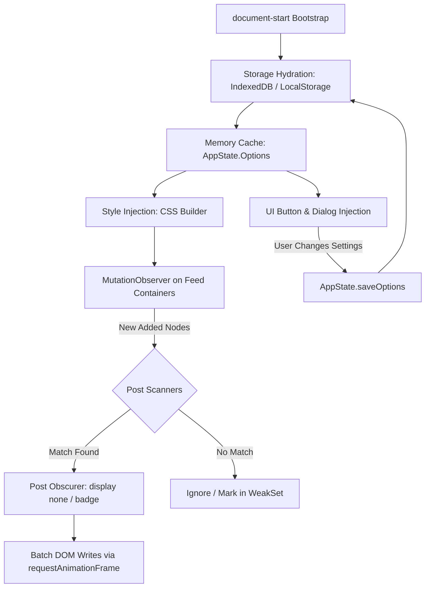

# Architecture & System Design

## 1. Overview

FB - Clean My Feeds is a modular client-side browser userscript that filters Facebook feeds in real time. It monitors DOM insertions using `MutationObserver`, evaluates post elements against active filter rules, applies non-destructive styling to conceal matches, and persists user settings in IndexedDB.



---

## 2. Source Code Organization

```text
src/
├── index.js                     # Userscript entrypoint & observer loop
├── constants/
│   ├── assets.js                # Base64 icons and SVG symbol strings
│   ├── config.js                # App constants, debounce thresholds, selectors
│   ├── db.js                    # Database name, object store keys
│   ├── dom.js                   # Facebook DOM selectors (feed containers, posts)
│   └── index.js                 # Barrel exports for constants
├── i18n/
│   ├── defaults.js              # Default English text mapping
│   ├── helpers.js               # Language resolution and translation getter
│   ├── paths.js                 # Language path resolvers
│   ├── index.js                 # i18n module entry point
│   └── locales/                 # 23 discrete locale files (en.js, vi.js, etc.)
├── modules/
│   ├── dialog/
│   │   ├── actions.js           # Save, Reset, Import, Export handlers
│   │   ├── components.js        # UI component factories (row, toggle, text filter)
│   │   ├── createDialog.js      # Modal shell & accordion sections constructor
│   │   ├── toggle.js            # Floating mop/bucket button controller
│   │   ├── updateDialog.js      # Dialog re-render and search filtering
│   │   └── index.js             # Dialog module exports
│   ├── post-obscurer/
│   │   ├── caption-builder.js   # "Post hidden. Rule: ..." badge formatting
│   │   ├── consecutive-group.js # Consecutive hidden post aggregation
│   │   ├── post-obscurer.js     # Post collapse & inline styling application
│   │   ├── visibility-toggle.js # Click-to-unhide toggle interaction
│   │   └── index.js             # Post obscurer module exports
│   └── user/
│       ├── defaults.js          # Baseline configuration options schema
│       ├── filters.js           # Text and Regular Expression compiler
│       ├── storage.js           # Async storage interface (idb-keyval + localStorage)
│       ├── user-options.js      # Preference serialization and normalization
│       └── index.js             # User module exports
├── state/
│   ├── app-state.js             # Reactive state store singleton
│   └── index.js                 # State module exports
├── styles/
│   ├── dialog-rules.js          # Settings modal CSS & logical properties
│   ├── post-rules.js            # Hidden post badges, collapsers & highlights
│   ├── toggle-rules.js          # Floating bucket & mop button styles
│   └── index.js                 # Styles module exports
└── utils/
    ├── css-builder.js           # Style tag injection helper
    ├── dom.js                   # Safe node traversal and query helpers
    ├── number.js                # Likes parsing and numeric sanitization
    ├── text.js                  # String normalization, diacritics removal
    ├── theme.js                 # Facebook theme detection (light vs. dark)
    ├── url.js                   # URL pattern matching (feed, group, watch)
    └── index.js                 # Utilities exports
```

---

## 3. Runtime Lifecycle & Data Flow

### 3.1 Bootstrap Phase
1. Script triggers at `document-start` via userscript manager header `@run-at document-start`.
2. Initial memory structures in `AppState` are initialized.
3. Asynchronous configuration hydration starts (`loadUserOptions()`).

### 3.2 DOM Readiness & Injection Phase
1. Detects `document.body` readiness.
2. Injects scoped styles into `<head>` using `CSSBuilder`.
3. Injects floating trigger button into the DOM (`initCMFToggle()`).
4. Binds hotkeys and userscript menu command (`GM.registerMenuCommand`).

### 3.3 Observation Phase
1. Queries target feed containers (`[role="feed"]`, `[role="main"]`, or document body).
2. Attaches a `MutationObserver` listening to `childList` additions.
3. Filters `mutation.addedNodes` for `nodeType === Node.ELEMENT_NODE`.
4. Checks nodes against a `WeakSet` cache (`processedPosts`). Nodes already evaluated are skipped immediately.

### 3.4 Evaluation & Post Hiding Phase
1. Determines current feed context via `URLUtils` (News Feed, Groups, Watch, Marketplace, Profile).
2. Executes matching scanner functions against candidate elements.
3. If matched, passes element to `PostObscurer`:
   - Non-destructive collapse: applies `display: none !important` or inline height collapsing.
   - If user enabled hidden post badges, renders an unobtrusive badge (`Post hidden. Rule: <RuleName>`).
   - Batches DOM writes using `window.requestAnimationFrame()`.

---

## 4. State Management & Storage Layer

```text
User Action / Defaults -> idb-keyval (IndexedDB) -> AppState.Options (Memory) -> Filter Execution
                                   │ (Fallback)
                                   └-> localStorage
```

- Primary Storage: `idb-keyval` (IndexedDB) under database name `fb_clean_my_feeds`.
- Fallback Storage: Standard `window.localStorage` when IndexedDB is restricted or unavailable (e.g. certain iframe contexts).
- In-Memory Cache: `AppState.Options` keeps a synchronous snapshot in memory so high-frequency `MutationObserver` loops evaluate zero-latency lookups without asynchronous delay.
- Serialization: Configuration objects are validated against schema defaults in `src/modules/user/defaults.js`.

---

## 5. Performance & Memory Safety Invariants

- Non-Destructive DOM: `node.remove()` and `parentNode.removeChild()` are prohibited. Removing nodes breaks Facebook's React fiber tree. All filtering uses CSS concealment.
- WeakSet Caching: Elements are stored in `WeakSet` instances, allowing automatic garbage collection when Facebook removes nodes during infinite scrolling.
- Batched Writes: DOM style updates are grouped in `window.requestAnimationFrame()` to avoid forced synchronous layout reflows.
- Container Scoping: Observers target specific feed subtrees rather than the entire `document` where possible.

---

## 6. Build & Packaging Architecture

- Input: `src/index.js` (entry point combining all modular components).
- Bundler: `scripts/build.js` executed via `bun run build`.
- Banner Generation: `scripts/utils/userscript.js` extracts metadata from `package.json` and prepends the GreasyFork-compliant userscript header block.
- Output: Single distribution bundle at `dist/fb-clean-my-feeds.user.js`.
- Invariant: Automated build scripts strictly target `dist/`. The `greasyfork-release/` directory is reserved for manual maintainer releases.
